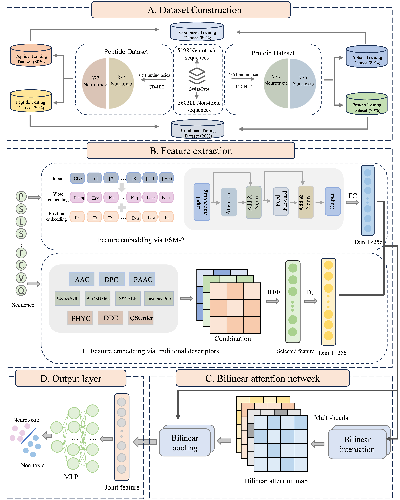

## Welcome to BiToxNet: A Deep Learning Framework Integrating Multimodal Features for Accurate Identification of Neurotoxic Peptides and Proteins
Accurate prediction of the neurotoxicity of peptides and proteins is critically important for the safety assessment of protein therapeutics and directly influences the development of protein-based drugs. Although traditional wet-lab methods can identify neurotoxic peptides and neurotoxins, they are labor- and resource-intensive and fail to meet the demands of high-throughput identification. Current computational approaches are constrained by shallow feature engineering and suboptimal multimodal fusion strategies, making it difficult to ensure strong model generalizability and limiting their applicability to real-world scenarios. To address these challenges, we present BiToxNet, a deep learning framework that integrates evolutionary embeddings with ten handcrafted biochemical descriptors through a bilinear attention network (BAN) module. BiToxNet incorporates a protein large language model to capture semantic information between residues and effectively integrates multiple features, including physicochemical properties. To simulate real-world scenarios, BiToxNet was evaluated on three datasets with different sequence lengths—Protein, Peptide, and Combined—achieving accuracies of 92.3%, 96.0%, and 92.7%, respectively, outperforming existing state-of-the-art methods. Ablation experiments validated the effectiveness of our feature representation design and highlighted the critical role of BAN. Furthermore, t-SNE visualizations and hierarchical clustering analyses demonstrated that BiToxNet learned highly discriminative features without relying on domain expert knowledge, further confirming the effectiveness of the proposed framework. Overall, BiToxNet offers a powerful and generalizable computational framework for neurotoxin identification, making a unique contribution to the field of protein drug discovery and providing a distinctive perspective for other biological sequence analysis tasks.



## 📚 Dataset for this study
We provided our dataset and you can find them [Dataset](https://github.com/Feng106-w/BiToxNet/edit/main/Dataset)
## 🔬 Source code and pre-trained model
We provide the source code and you can find them [Code](https://github.com/Feng106-w/BiToxNet/edit/main/Code)

The pre-trained model used in BiToxNet is [esm2 t30 150M UR50D](https://huggingface.co/facebook/esm2_t30_150M_UR50D)

## 🛠️ Requirements
```
Python==3.12.3
PyTorch==2.5.1
scikit-learn==1.6.1
NumPy==2.1.3
Pandas==2.2.3
joblib==1.4.2
```

## 🚀 Usage
Train the model with 5-fold cross-validation:
```bash
python train.py
```

